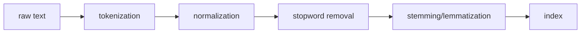

# Stopword Removal

## Stopwords

Stopwords are high-frequency words that carry little to no discriminative meaning on their own; words like "the", "is", "a", "of", "and" etc. Stopword removal is the process of filtering these out before indexing or query processing.

## Why does it matter?

In any large corpus, a handful of words account for a disproportionate share of all occurrences. "The" alone can make up 5-7% of all tokens in English text. If you index these, you get postings lists that contain almost every document; they are useless fordistinguishing relevant from irrelevant results, and they bloat the index significantly.

Zipf's Law explains this: word frequency is inversely proportional to its rank. The most frequent word appears roughly twice as often as the second most frequent, three times as often as the third, and so on. Stopwords sit at the very top of this distribution.

## How it works

### 1. The stoplist

A predefined list of words to filter out. Common ones include:

- Articles: "a", "an", "the"
- Prepositions: "in", "on", "at", "of", "for"
- Conjunctions: "and", "but", "or", "nor"
- Pronouns: "he", "she", "it", "they"
- Auxiliary verbs: "is", "are", "was", "were", "be"

NLTK's English stoplist has ~179 words. spaCy's has ~326.

### 2. Frequency-based stopwords

Instead of a fixed list, compute word frequencies across the corpus and treat the top-N
most frequent terms as stopwords. More adaptive but less portable across domains.

### 3. Where in the pipeline

Note: some pipelines apply stemming before stopword removal. Either order works but
removing stopwords first is more common since it reduces the number of tokens to stem.

## When stopword removal hurts

This is the most important thing to understand about stopwords - removal is not always the right call.

### Phrase queries break

- "to be or not to be" --> after removal: [] (empty)
- "The Who" (the band) --> "who" - loses all meaning
- "flights to Boston" --> "flights Boston" - query intent survives, but barely

### Named entities get damaged

- "The The" (a band), "Take That", "Men at Work" - all destroyed by aggressive removal

### Relational queries lose meaning

- "python is better than java" --> "python better java" - loses the comparative structure

### Modern IR has largely moved past hard stopword removal

**BM25** and **TF-IDF** already downweight high-frequency terms via IDF - so stopwords naturally get low scores without being explicitly removed. Neural models handle them even more gracefully through attention mechanisms.

## My Summary

Stopword removal filters out high-frequency, low-meaning words to reduce index size and improve retrieval signal. It works well for simple keyword queries but breaks for phrase queries and named entities. In modern IR it is less necessary than it used to be - TF-IDF and BM25 handle common words via IDF naturally, and neural models handle them via attention. Still worth knowing because it appears in almost every classical IR pipeline and many production systems still use it for efficiency.
